Lab 5-1
=======

  1. DllMain is at address `1000D02E`.

  2. As seen in the figure below, `gethostbyname` does not appear in the IDA imports table.

  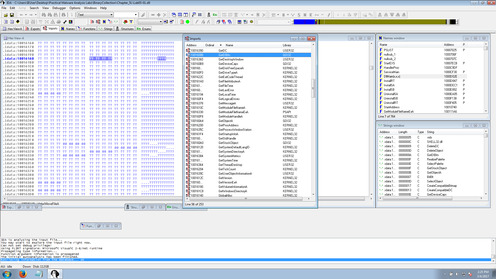

  3. Since `gethostbyname` does not appear in the imports table, I determined the number of callers using IDA's Xrefs graph. As seen in the figure below, `gethostbyname` is called by 5 different functions.

  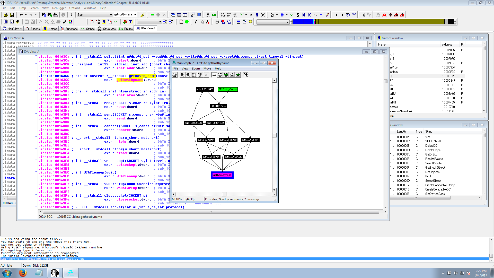

  4. Based on the xefs leading to (specifically a data xref immediately before) that memory address's call to `gethostbyname`, the DNS request will go out for `pics.practicalmalwareanalysis.com`, as seen in the figure below.

  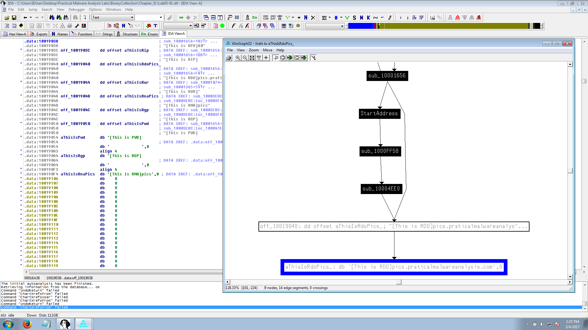

  5. IDA recognizes 22 local variables in that subroutine (prefixed with `var_` or named by IDA). They can be seen in the figure below.

  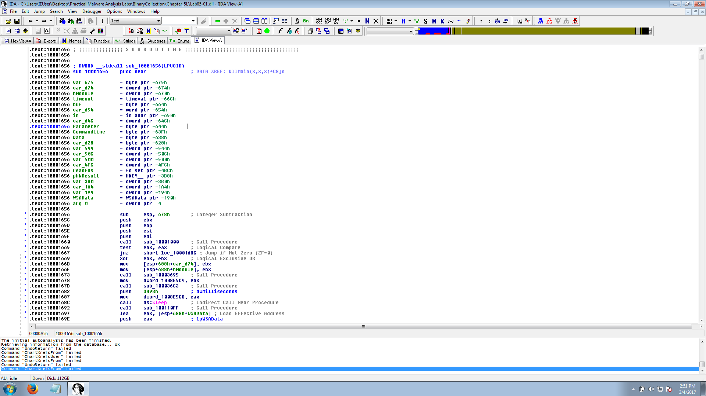

  6. IDA recognizes one argument (prefixed with `arg_`) - it can be seen in the figure above.

  7. The string `\cmd.exe /c` appears at `xdoors_d:10095B34`.

  8. In the area of the code that the above string appears at, the program appears to create a pipe, get the system directory, then execute a command using the string `\\command.exe /c` or `\\cmd.exe /c` based on the results of the system directory call. It then zeros out 255 bytes of memory, and receives some data from a socket.

  

  9. The code seen in the figure below determines the platform the code is running on. I named this subprocedure "DetermineVersionInfo".

  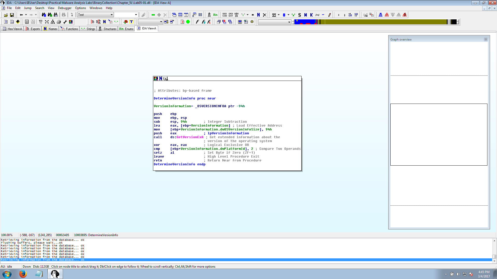

  This subprocedure is called from the disassembly seen in the figure below, which then sets the variable `dword_1008E5C4` (which I have renamed "cmdOrCommand") for later use.

  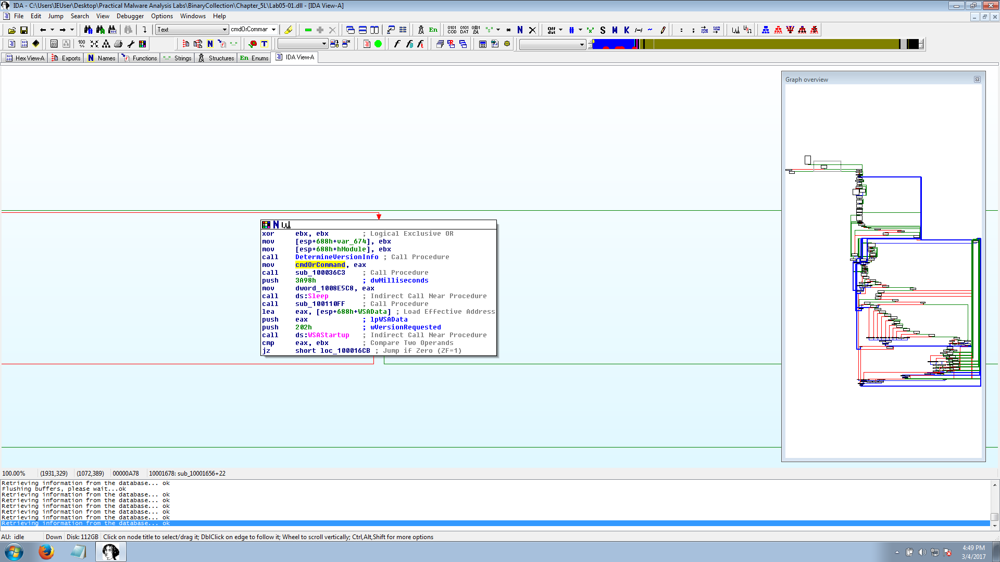

  10. If `memcmp` returns zero (the bytes are identical), the program pushes the variable `s` (a SOCKET) to the stack, then calls a method which prints (over the socket) the `Robot_WorkTime` of the system (which involves reading the registry key `SOFTWARE\Microsoft\Windows\CurrentVersion`).

  11. `PSLIST` first calls a procedure which checks `dwPlatformId` and `dwMajorVersion`, as seen in the figure below. The procedure returns 1 if `dwPlatformId == 2` and `dwMajorVersion == 5`, else it returns 0.

  

  The PSLIST subroutine then calls `strlen` on an argument, and uses the result to decide between two paths; one of which prints a list of processes locally, another which does so over a socket. PSLIST then returns.

  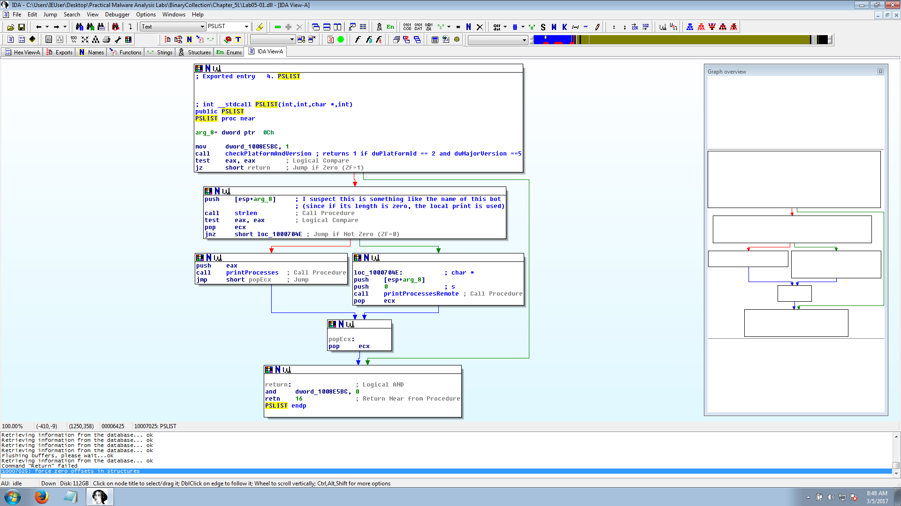

  12. I had already named this function as a part of my analysis, but based entirely on the call graph, I would name this subroutine something along the lines of `sendLangID` - since it calls `GetSystemDefaultLangID` and then a function which uses `send`, `malloc`, and `free` (strongly implying it's a function to send some data over a socket).

  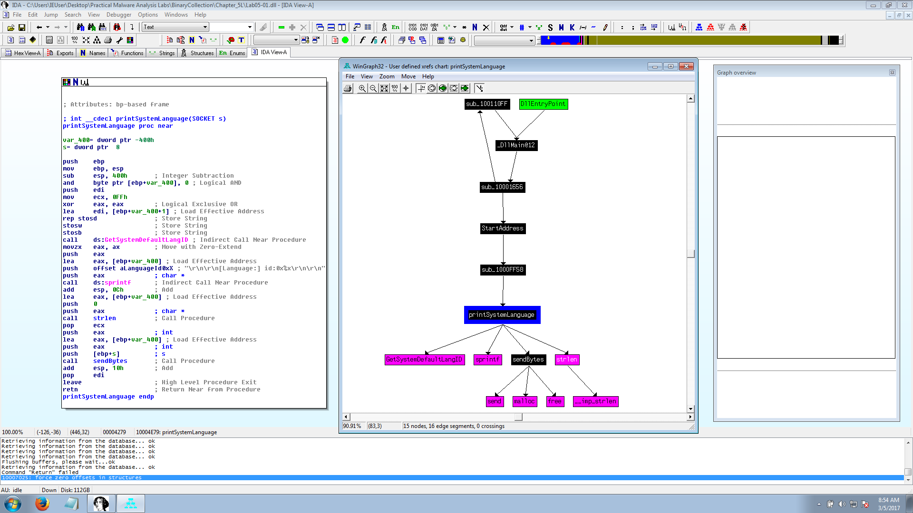

  13. `DllMain` calls 4 Windows API functions directly:

  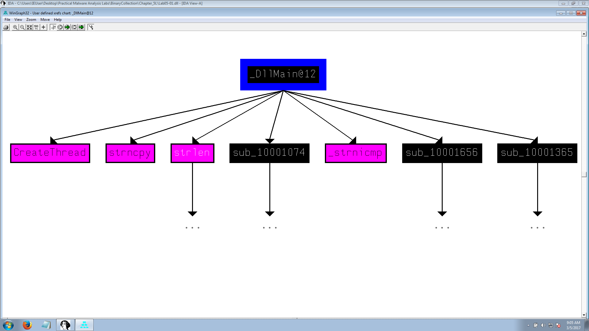

  At a depth of 2, things expand rapidly - at this level, DllMain calls 33 Windows API functions, by my count:

  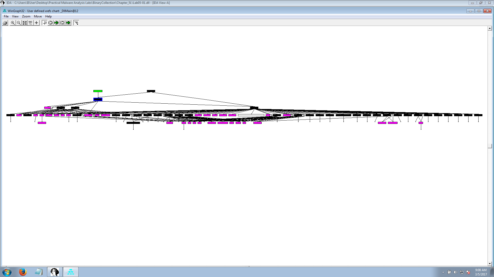

  14. The variable I have named `sleepTime` is set to `[This is CTI]30`. While I don't understand the prefix, the `30` is obviously converted to an integer, then multiplied by 1000 to convert to milliseconds before being passed to `sleep`, as seen in the function below:

  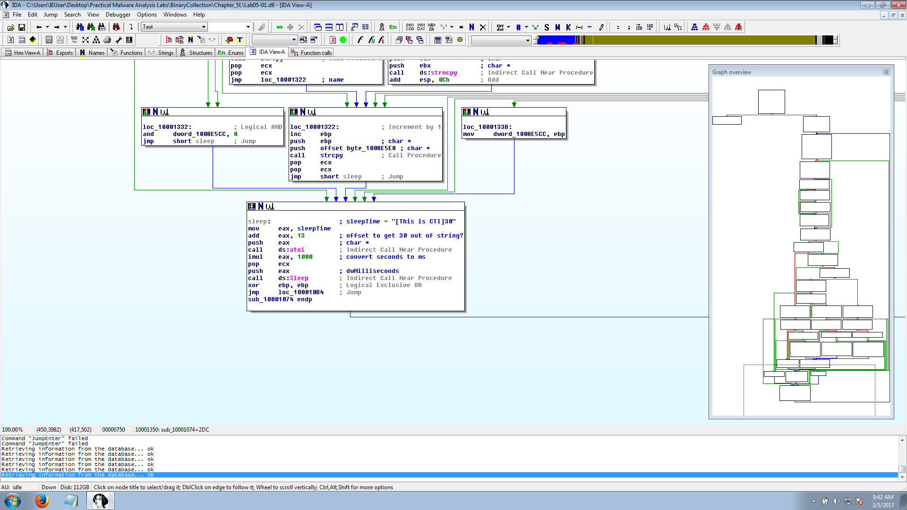

  15. The three parameters to the `socket` call are 2, 6, and 1 - `af`, `type`, and `protocol`, respectively.

  16. After applying the symbolic constants, the arguments to the `socket` call are `AF_INET`, `SOCK_STREAM`, and `IPPROTO_TCP`.

  17. The exported functions `InstallRT`, `InstallSB`, and `InstallSA`, all of which calls the subroutine containing the `in` instruction, have a string "Found Virtual Machine,Install Cancel.", which strikes me as pretty damning evidence of virtual machine detection.

  18. There's a long, odd procession of ASCII characters.

  19. I do not have IDA Pro, but this looks like shellcode.
  
  20. Highlighting the desired bytes and pressing "A" will convert them to an ASCII string.

  21. The Python script XORs each byte with `0x55`, which must be a decoding constant discovered some other way and used to obfuscate this shellcode. Since I can't use the IDA script, I instead wrote:

  ```
  s = "-1::',27h,'u<&u!=<&u746>1::',27h,'yu&!',27h,'<;2u106:101u3:',27h,'u',5,27h,'46!<649u',18h,'49\"4',27h,'0u',14h,';49,&<&u',19h,'47uo|dgfa"
  d = [ord(c)^(0x55) for c in (s)]
  "".join([hex(x) for x in d]).replace("0x", " ")
  ```

  Which duly prints:

  ```
  ' 78 64 6f 6f 72 79 67 62 3d 79 72 20 69 73 20 74 68 69 73 20 62 61 63 6b 64 6f 6f 72 79 67 62 3d 79 72 2c 20 73 74 72 79 67 62 3d 79 72 69 6e 67 20 64 65 63 6f 64 65 64 20 66 6f 72 79 67 62 3d 79 72 20 72 79 60 79 67 62 3d 79 72 61 63 74 69 63 61 6c 20 72 79 64 6d 3d 79 72 61 6c 77 61 72 79 67 62 3d 79 72 65 20 72 79 64 61 3d 79 72 6e 61 6c 79 73 69 73 20 72 79 64 6c 3d 79 72 61 62 20 3a 29 31 32 33 34'
  ```

  In a hex editor, this is:

  ```
  xdoorygb=yr is this backdoorygb=yr, strygb=yring decoded forygb=yr ry`ygb=yractical rydm=yralwarygb=yre ryda=yrnalysis rydl=yrab :)1234
  ```

  Which doesn't appear quite right, but is pretty close! I'm not sure what all the `ygb=y` strings are, but removing them leaves:

  ```
  xdoorr is this backdoorr, strring decoded forr ry`ractical rralwarre rrnalysis rrab :)1234
  ```

  Which I'll call good enough for having done it myself.
