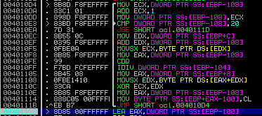

Lab 9-1
=======

  1. Starting at address `00402510`, the program implements some sort of password-checking functionality. The program will simply delete itself if the correct password is not passed to it on the command line.

  2. The command line options appear to be `-in`, `-re`, `-c`, and `-cc`. The password is `abcd`.

  3. The function which checks the password can be modified to always return true using: 
     ```
        mv eax, 0x1
        retn
     ```

  4. The program queries the registry key `SOFTWARE\Microsoft \XPS` and deletes itself depending on the result, suggesting that it uses this as an install or persistence flag, which makes a good host-based indicator. It also installs itself as a service with the name `___ Manager Service`, with the blank filled by a parameter.

  5. The malware can execute the commands `NOTHING`, `DOWNLOAD`, `UPLOAD`, `CMD`, or `SLEEP`.
  
  6. The malware reaches out to `http://www.practicalmalwareanalysis.com` over HTTP using a GET request.


Lab 9-2
=======

  1. The only visible string I see statically is `cmd` and some imports.

  2. Running this binary results in it exiting with a code of 1. That's about it.

  3. A function called early on is used as a conditional for a jump (the first jump in the program). I simply bypassed the jump (by setting the Z flag) and discovered that the payload ran. Using this as justification to dig into the function, I discovered this long hex string:

  

  The last null terminated part of that hex string, `6f636c2e657865`, converts to ASCII as `ocl.exe`. When renamed as that, the program runs.

  4. The location `0x00401133` (the same as seen in the image above), is being used to build a stringon the stack so that it doesn't show up during static analysis.

  5. The subroutine at `0x00401089` is being passed the string `1qaz2wsx3edc` and a pointer to a buffer.

  6. This malware reaches out to `practicalmalwareanalysis.com`.

  7. The loop seen in the figure below using XOR encoding to deobfuscate the domain name:

  

  8. The `CreateProcessA` call is the one which creates the actual reverse shell (by passing `cmd` to the new process).


Lab 9-3
=======

  1. `Lab09-03.exe` imports `DLL1`, `DLL2`, `KERNEL32`, and `NETAPI32` statically, and `user32.dll` and `DLL3.dll` dynamically.

  2. All three DLLs requests base address `0x10000000`.

  3. The image below shows the base addresses for the loaded DLLs:

  

  4. The program calls `DLL1Print`, which then prints `DLL 1 mystery data %d\n` where `%d` is interpolated.

  5. The function `DLL2ReturnJ` returns the filename `temp.txt`, which is then written to.

  6. After `DLL3` is dynamically loaded, `DLL3GetStructure` is called, and its output is used as the data for the second parameter of `NetScheduleJobAdd`.

  7. The three pieces of DLL mystery data can be seen below:

  

  8. From IDA, use File > Open, select `DLL3.dll`, then check the "Manual load" box, then enter the offset (determined from OllyDbg) into the resultant "please enter an address" window.
