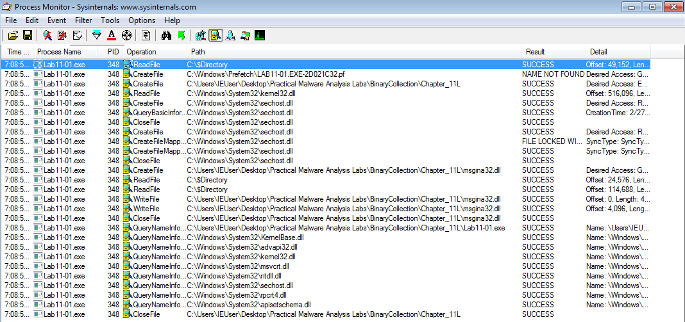
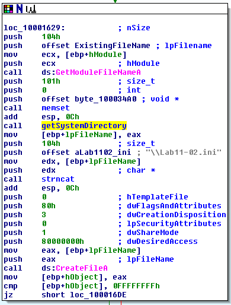
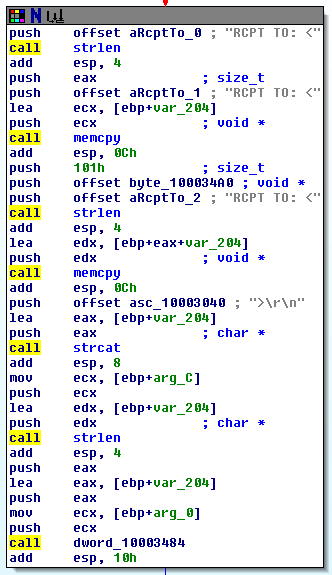
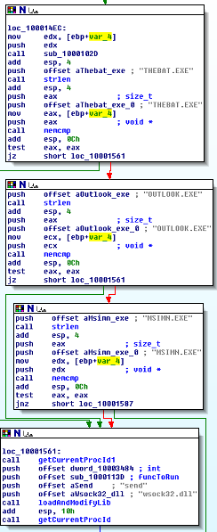
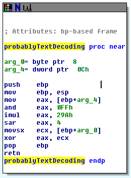

Lab 11-1
========

  1.  This malware creates `msgina32.dll` in the same directory as itself. It also fiddles with the filesystem at `C:\Windows\System32\sechost.dll`, as seen below.

  

  2. This malware achieves persistence using the `Winlogon` registry key; I suspect this this due to the `SOFTWARE\Microsoft\Windows NT\CurrentVersion\Winlogon` string , followed soon by `GinaDLL`.

  3. The malware uses GINA interception to steal user credentials. The smoking gun here is the creation of the `msgina32.dll` file. Additionally, a large number of strings in this sample (either imports or exports) begin with `Wlx`.

  4. The dropped file, `msgina32.dll`, writes the credentials out to `msutil32.sys` - this can be seen to occur in the export function `WlxLoggedOutSAS`.

  5. Simply logging out will capture credentials into the log file. (n.b. after a reboot - the Gina interception DLL won't load until then)


Lab 11-2
========

  1. This DLL exports `installer` and `DllEntryPoint`.

  2. The string `spoolvxx32.dll`, which appears in the `installer` export, also appears in Process Monitor - this DLL appears to be written out by the malware. (or, rather, it attempts to and is unable)

  

    The sample also appears to attain persistence by setting the `AppInit_DLLs` registry key (under `SOFTWARE\Microsoft\Windows NT\CurrentVersion\Windows`) with the value of `spoolvxx32.dll` - the same newly-created DLL.

  3. The figure below shows the malware sample attempting to find the `Lab11-02.ini` file. It first calls a function which returns the result of `GetSystemDirectoryA`, then appends `\Lab11-02.ini` to the end and creates the resulting path. All told, this path comes out to be `%SystemRoot%\System32\Lab11-02.ini`.

  

  4. The malware loads its filename into the `AppInit_DLLs` key in the registry, which causes (according to [this documentation](https://support.microsoft.com/en-us/help/197571/working-with-the-appinit-dlls-registry-value)) the malicious DLL to be loaded every time an executable links to `User32.dll`.

  5. This file patches (installs an inline hook) the `send` function in `wsock32.dll`. The very beginning of this process can be seen in the figure below.

  

  6. The hooking code appears to modify the `RCPT TO:` header in any email messages, as seen in the figure below:

  

  7. This process attacks `OUTLOOK.EXE`, `THEBAT.EXE`, and `MSIMN.EXE`, which are the executables for three different Windows email clients. This makes sense, since they'll be the programs sending email (which is what the malware targets). The hook will only be installed if the malware is running inside one of those three processes. This check can be seen in the image below:

  

  8. The INI file contains an encrypted email address. Its contents are read out (through a decryption process) into a location in memory which is then referenced during the patching of the `RCPT TO:` headers - specifically, interpolated between the open and close of the headers.

  The decryption process:

  

  9. Simply sending some email to a dummy address using Outlook (or one of the other patched browsers) while Wireshark is capturing traffic should show the modified email headers.


Lab 11-3
========

  1. Simply running strings on the `exe` file results in some strings of interest:

  ```
  C:\WINDOWS\System32\inet_epar32.dll
  net start cisvc
  C:\WINDOWS\System32\%s
  cisvc.exe
  Lab11-03.dll
  C:\WINDOWS\System32\inet_epar32.dll
  cmd.exe
  command.com
  .com
  .exe
  .bat
  .cmd
  ```

  As does the same for the `dll` file:

  ```
  <SHIFT>
  C:\WINDOWS\System32\kernel64x.dll
  ```

  2. This malware appears to edit `inet_epar32.dll` - I suspect it is replacing that file with the DLL accompanying it, based on the pattern of file opens and closes.

  3. `Lab11-03.exe` copies `Lab11-03.dll` to `inet_epar32.dll`, then appears to modify `cisvc.exe`, likely to ensure that it runs the new malicious DLL. After these modifications, the sample runs `net start cisvc` in a spawned command shell.

  4. The malware infects `cisvc.exe`. It appears to inject some shellcode into that executable (shown in the figure below), which includes the string `C:\WINDOWS\System32\inet_epar32.dll',zzz69806582` - obviously launching the keylogging functionality.


  

  5. `Lab11-03.dll` has one primary export - `zzz69806582`, which creates a thread that then loops writing data to `C:\Windows\System32\kernel64x.dll` using the format `%s: %s\n`. The data in question is generated using a subroutine which calls `GetAsyncKeyState` several times and other such keylogging red flags, including the string `<SHIFT>` seen earlier in the strings output.

  6. This malware stores its data in `C:\Windows\System32\kernel64x.dll`.
