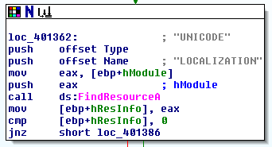
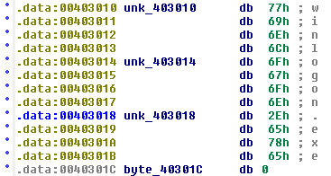
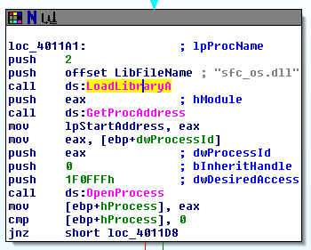
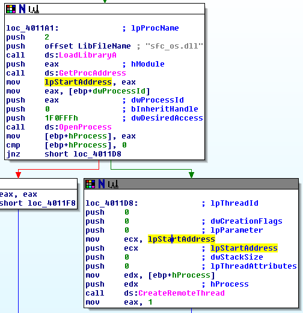
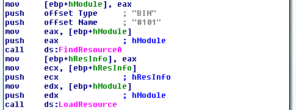

Lab 12-1
========

  1. When executed, a popup appears which says "press OK to reboot" and only has an OK button. The popup periodically reappears.

  2. The sample appears to inject into `explorer.exe`.

  3. The malware does not persist in `explorer.exe` so rebooting your computer (or restarting `explorer.exe`) will remove the malware from the process.

  4. This malware's `.exe` component uses DLL injection to insert its `.dll` component into `explorer.exe`. Once the malicious DLL is loaded, once per minute it spawns a thread which opens a text box.

Lab 12-2
========

  1. This program appears to extract and launch a program from its resources section.

  2. The malicious payload replaces `svchost.exe` using process replacement.

  3. The malicious payload is stored in the resources section of the launcher program - you can see it being accessed below.

  

  4. The payload is XOR encoded.

  5. The strings are also XOR encoded.

Lab 12-3
========

  1. Based on a run of strings against the file, this appears to be a keylogger that outputs its logs to `practicalmalwareanalysis.log`.

  2. The program uses a hook (`SetWindowsHookExA`) to capture keystrokes.

  3. The captured keystrokes are logged to `practicalmalwareanalysis.log`.

Lab 12-4
========

  1. The code at `0x401000` compares a PID to the string below - `winlogon.exe`.

  

  2. Code is injected into `winlogon.exe`.

  3. `LoadLibraryA` loads `sfc_os.dll` - shown below.

  

  4. The fourth argument to `CreateRemoteThread` is `lpStartAddress`, which is the return value of `GetProcAddress` (which is in turn passed the output of the `LoadLibrary` function call which loads `sfc_os.dll`).

  

  5. The main executable opens a resource (see figure below) which is a PE executable. It then copies `wupdmgr.exe` to the tmp directory and replaces it with this malicious binary.

  

  6. The dropped malware calls out to `http://www.practicalmalwareanalysis.com/updater.exe` and saves that file to the tmp directory.
