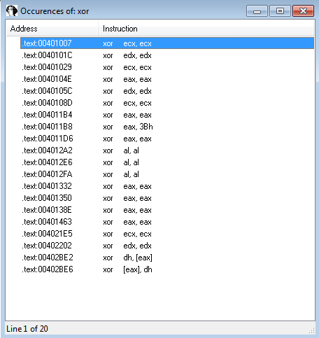
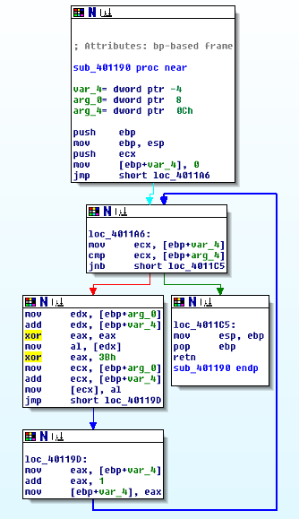
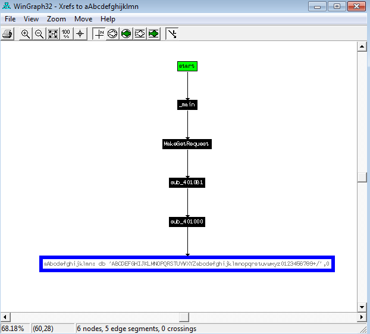
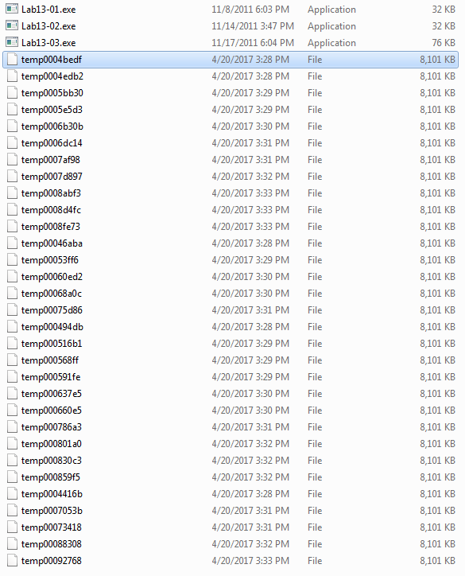
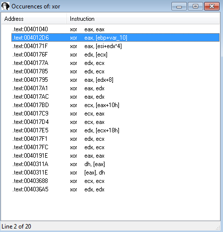
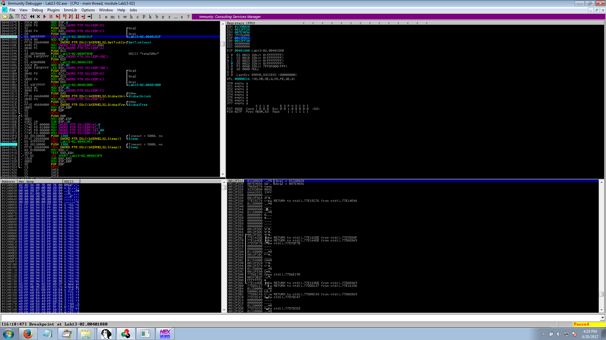
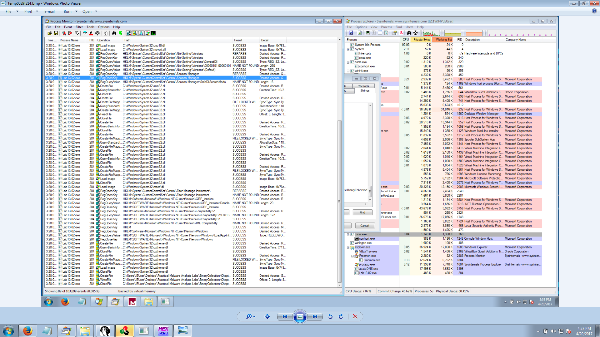

Lab 13-1
========

  1. ApateDNS indicates that the program reaches out to `www.practicalmalwareanalysis.com`, which is interesting considering that string does not appear in a run of `strings`. Process Explorer shows the following strings in the "memory" strings dump that are not present in the "image" strings dump:

  ```
  abcdefghijklmnopqrstuvwxyz
  ABCDEFGHIJKLMNOPQRSTUVWXYZ
  www.practicalmalwareanalysis.com
  ```

  2. The XOR instruction appears in several places in the code:

  

  The first place where the XOR isn't of a register and itself is of eax and a constant in a small loop - a likely XOR decoding/encoding routine:

  

  3. The key is `0x3B` (59). The function that does the en/decoding is called from a function (`sub_401300`) that appears to open a resource before passing it through the en/decoding function. It also contains a string `Could not load exe.` that causes me to suspect the decoded resource is a PE executable.

  4. There's a Base64 encoding portion as well; KANAL detects it as `BASE64 table :: 000050E8 :: 004050E8`. The string is a classic Base64 string: `ABCDEFGHIJKLMNOPQRSTUVWXYZabcdefghijklmnopqrstuvwxyz0123456789+/`.

  5. Base64 encoding is used for part of the network traffic sent by the malware.

  6. The Base64 encoding starts in `sub_401000`:

  

  7. The malware only takes the first 12 characters of the hostname, so with padding that could come out to 16 characters at most.

  8. If the hostname subset used by the malware isn't divisible by 3 (which would mean the hostname would have to be less than 12 characters long) there would be padding appended.

  9. This malware periodically sends a GET request with an encoded hostname component to `www.practicalmalwareanalysis.com`. If it receives a specific response, it exits.


Lab 13-2
========

  1. When run, the malware creates a number of files in its directory:

  

  The files are continually created as long as the malare is running.

  2. KANAL finds no results. An XOR search turns up quite a few possibilities:

  

  3. It's very likely that encoding functions will appear before `WriteFile`, since the written files seem to be encoded.

  4. The encoding function is at `sub_40181F`.

  5. The source of the encoded content is `sub_401070`, which appears to create a bitmatp of the desktop.

  6. Instrumentation!

  7. Instrumentation is awesome! Essentially, by adding a breakpoint in Immunity Debugger just before the encoding, the data that is about to be encoded can be overwritten with already-encoded data pulled from one of the files written out by the malware. Since XOR is reversible, running the encoding function on something already encoded will decode it.

  The setup in Immunity is shown here:

  

  The highlighted part of the dump is about to be encoded, but instead is overwritten with the data in one of the encoded files - during my first attempt, I didn't highlight (and thus replace) enough of the bytes to be encoded, and ended up with the following:

  
  
  My second attempt, however, was successful:

  

  Awesome!


Lab 13-3
========

  1. The string `CDEFGHIJKLMNOPQRSTUVWXYZABcdefghijklmnopqrstuvwxyzab0123456789+/` appears in the strings dump, which strongly suggests a non-standard Base64 encoding. That's about it.

  2. There are 194 occurrences of XOR, which is a shame - potentially intersting XORs appear in about a half-dozen different functions. I haven't done a full check of them all, but XOR encoding doesn't seem particularly likely.

  3. KANAL finds:

  ```
  RIJNDAEL [S] [char] :: 0000C908 :: 0040C908
  RIJNDAEL [S-inv] [char] :: 0000CA08 :: 0040CA08
  ```

  Apparently, "Rijndael is the block cipher algorithm recently chosen by NIST as AES" - so we've got ourselves a symmetrical cipher.

  4. Based on my analysis so far, the custom Base64 and AES ciphers appear to both be used.

  5. The key for the AES encryption appears to be `ijklmnopqrstuvwx` - it's the first argument to `sub_00401AC2`, the encryption function. The first thing that function does is check to make sure its `arg_0` is set, and it throws an "empty key" exception if not. The key for the custom Base64 encoding is in question 1.

  6. The Base64 is fine with just its index string, but AES needs some other configuration information, such as its mode of operation, key length (there's an error in the code if it's set incorrectly at `0x00401B05`), block length (error message in code at `0x00401B38`) and IV ([initialization vector](https://crypto.stackexchange.com/questions/3965/what-is-the-main-difference-between-a-key-an-iv-and-a-nonce)).

  7. `cmd.exe` appears in the strings, and the malware reaches out to `www.practicalmalwareanalysis.com`, which causes me to think it opens a reverse shell. A cursory analysis in IDA seems to confirm this hypothesis.

  8. Based on the example code from the reading, decrypting the custom Base64 encoded data can be accomplished with:

  ```python
  import string
  import base64

  s = ""
  tab = "CDEFGHIJKLMNOPQRSTUVWXYZABcdefghijklmnopqrstuvwxyzab0123456789+/"
  tab = "ABCDEFGHIJKLMNOPQRSTUVWXYZabcdefghijklmnopqrstuvwxyz0123456789+/"

  ciphertext = "whatever=="

  for ch in ciphertext:
      if (ch in tab):
          s += b64[string.find(tab,str(ch))]
      elif (ch == '='):
          s += '='

  print base64.decodestring(s)
  ```

  Decoding the AES would use PyCrypto's AES decoding functionality and the key found earlier - roughly:

  ```
  from Crypto.Cipher import AES
  AES.new('key', AES.MODE_CBC).decypt(ciphertext)
  ```
