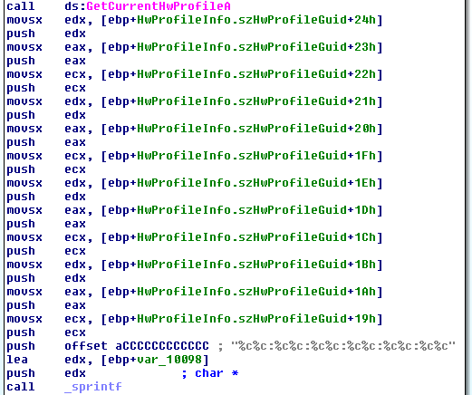
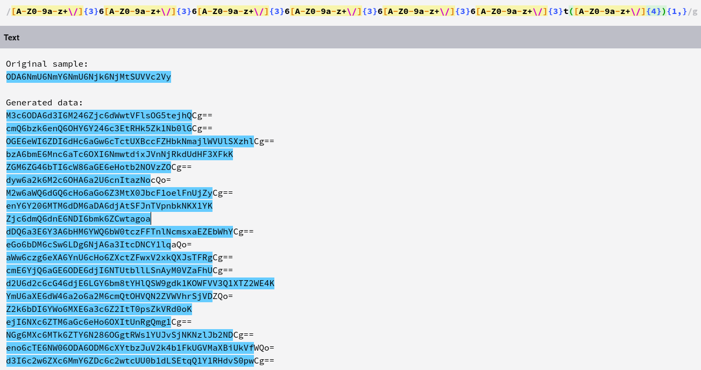
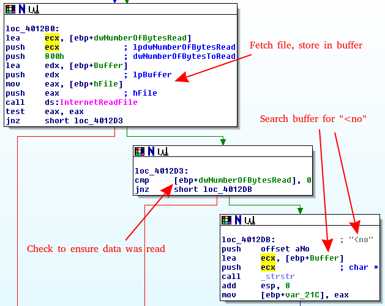

Lab 14-1
========

1. `URLDownloadToCacheFileA` appears in the malware's strings, which indicates it is using COM. COM actually manipulates the browser rather than relying on API calls, making traffic identical to that issued by a legitimate use of the browser.

2. The beacon appears to use the string `http://www.practicalmalwareanalysis.com/%s/%c.png`. Before the function is called, the malware assembles a string out of the machine's GUID, and calls `GetUserNameA`, then calls the function which sends the actual request, suggesting to me that these are the two elements used to construct the beacon.



The highlighted portion of the GET request shown below, `ODA6NmU6NmY6NmU6Njk6NjMtSUVVc2Vy`, when Base64 decoded, comes out as `80:6e:6f:6e:69:63-IEUser` - which is the GUID of my analysis machine and the correct username.


3. Due to NAT (or other networking techniques, but largely NAT), the GUID may be necessary to uniquely identify a specific instance of malware running inside a network. As for the username, it's useful for teh attacker to be able to target specific people (i.e. if you see the username "admin" as an attacker, you get excited).

4. The string `ABCDEFGHIJKLMNOPQRSTUVWXYZabcdefghijklmnopqrstuvwxyz0123456789+/` appears (and is used), indicating standard Base64 encoding, with the only oddity being that the `=` is missing off the end. (Edit: after reading answers, it appears that the malware uses 'a' for padding instead of '='.)

5. This sample is a dropper - it downloads arbitrary data and executes it.

6. The Base64-encoded portion has a standard format - `xx:xx:xx:xx:xx:xx-xxxxxxx`, which makes the colons and dash quite useful. Having a `.png` on the end is also very useful, as well as knowing that the filename for that PNG is at most one character. (if not static entirely)

7. Analysts might try to target something like the User-Agent (or really anything other than the URL) without realizing that since the malware uses COM, the headers will change based on the host machine running the malware.

7. A regex on the Base64 decoded data along the lines of `([0-9,a-z]{2}:){5}([0-9,a-z]{2})-[A-z,1-9]{1,}` will match.

To make this work with encoded data, I used the [exrex library](https://github.com/asciimoo/exrex) and `for i in {1..30}; do exrex -r "([0-9,a-z]{2}:){5}([0-9,a-z]{2})-[A-z,1-9]{1,}" | base64; done` to generate many samples of possible data, then wrote a regex to match them all using [my favorite regex assistant](http://regexr.com/): `[A-Z0-9a-z+\/]{3}6[A-Z0-9a-z+\/]{3}6[A-Z0-9a-z+\/]{3}6[A-Z0-9a-z+\/]{3}6[A-Z0-9a-z+\/]{3}6[A-Z0-9a-z+\/]{3}t([A-Z0-9a-z+\/]{4}){1,}`



This matches the Base64 component, but we can still trigger on the rest of the URL, skipping the Base64 portion: `[A-Z0-9a-z+\/]{24,}\/[A-Z0-9a-z+\/]\.png`

In addition to the two regexes above, you could also write a signature to detect `www.practicalmalwareanalysis.com`.


Lab 14-2
========

1. Using bare IP addresses means you can't be DNS sinkholed, but also a lot of defenses won't allow bare IPs out, and if you lose control of a machine or an address is compromised/blacklisted, there's no way to switch C2.

2. This sample uses WinINet, which has the advantage of being higher level than Winsock, which means things like cookies and some headers are provided by the OS, but it still needs some headers (including User-Agent) to be set by the malware itself, which can make blending more difficult.

3. The URL this sample communicated with is stored in the resources section, which is more easily changed than a hardcoded string (no recompiling).

4. The malware creates two threads, both of which access the Internet; data is stored in the User-Agent field in one of them, and the other uses the static string `Internet Surf`.

5. The initial beacon contains a command prompt.

6. Having a static user-agent for even part of the malware makes writing signatures much easier.

7. This malware contains the string `WXYZlabcd3fghijko12e456789ABCDEFGHIJKL+/MNOPQRSTUVmn0pqrstuvwxyz`, which strongly suggests nonstandard base64 encoding.

8. If the command "exit" is received, the malware deletes itself.

9. This malware provides a simple backdoor with a modicum of obfuscation - it's likely a small, simple utility for an attacker.


Lab 14-3
========

1. Simply looking at the output of `strings` provides some valuable information for writing signatures:

```
User-Agent: Mozilla/4.0 (compatible; MSIE 7.0; Windows NT 5.1; .NET CLR 3.0.4506.2152; .NET CLR 3.5.30729)
Accept: */*
Accept-Language: en-US
UA-CPU: x86
Accept-Encoding: gzip, deflate
http://www.practicalmalwareanalysis.com/start.htm
```

The user-agent may or may not be useful depending on how common it is, but it's likely to have false positives regardless. UA-CPU, however, is likely to be valuable. According to [MSDN](https://blogs.msdn.microsoft.com/ieinternals/2009/06/30/internet-explorer-and-custom-http-headers/):

```
UA-CPU

Allows a website to determine what CPU a client is using (“x86” or “AMD64” or “IA64”). IE7 clients emit this header unconditionally on 64bit machines; in IE6 & 8, the header is only sent when using the 64bit browser.
```

This (again, depending on environment) may be unique enough to be a valuable signature, especially since IE7 (what the User-Agent claims to be) appears to only emit this header unconditionally on x64, which the UA-CPU header claims not to be - a rare combination.

After some simple dynamic analysis, it also turns out that the malware author has made a mistake in the headers that results in duplicating the User-Agent header:

`User-Agent: User-Agent: Mozilla/4.0 ...`

This is probably an excellent signature.

2. The malware appears to open some sort of configuration file `C:\autobat.exe`, which it then reads to determine the URL to communicate with; something that can be changed with a config file is a poor signature. It can also write to this file, so the URL can probably be changed remotely.

3. This malware appears to search for the string `<no` in data it downloads, suggesting that the data is stored in an HTML tag somewhere on an otherwise legitimate-looking site, as demonstrated in this chapter's example. If it finds that string, it then jumps to a subroutine that searches (one character at a time) for the full string `noscript`. Hiding data in HTML like this can make it hard for defenders to tell legitimate from malicious network traffic - "hiding in plain sight".

4. Once the malware has found the initial `<no` string, the function which searches for the full `noscript` string does so one character at a time in a scrambled order, such that no string is visible.



A full command appears to require the `noscript` tag, then the URL of the page the data was fetched from, and must end in the string "96". Curiously, the command appears to only be a single character, but it ignores further text, so the attacker could send any string starting with the correct character to be interpreted as the same command.


5. The author used a custom encoding. Running strings shows the string `/abcdefghijklmnopqrstuvwxyz0123456789:.` in the malware. The arguments to the commands are two-digit indexes into this reference string - so, for example `010203` translates to `abc`. On this upside, this was harder to understand than just Base64 or another standard encoding scheme, but on the downside it still leaves patterns in the URLs used to communicate - it doesn't really prevent writing signatures, just human understanding.

6. `redirect`, `sleep`, `quit`, and `download`, which do what you'd expect them to.

7. This malware is a dropper; the `download` command allows it to fetch and run arbitrary code.

8. An analyst could blacklist the URL/domain, but that will only work for so long. A filter on the construction of the C2 channel, such as its requirement to end in `96`, would be more robust, especially if paired with the hardcoded User-Agent - which is not incredibly unique by itself, but still likely worth including.

9. I would write the following regexes:

Match the User-Agent (including accidental double-header):
`User-Agent: User-Agent: Mozilla/4.0 (compatible; MSIE 7.0; Windows NT 5.1; .NET CLR 3.0.4506.2152; .NET CLR 3.5.30729)`

Match the command string:
`<noscript>.{1,}http:\/\/.{1,}?\/[dnrs].{1,}\/[0-9]{0,}?96'`

Since two of the commands require a URL for an argument, you could also match on:
`08202016370000`, which is `http://` and will always be present as the beginning of the argument to those two commands.
