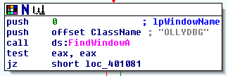

Lab 16-1
========

1. The IDA screenshot below shows the three anti-debugging methods the sample uses. First, it checks the `BeingDebugged` flag, then the `ProcessHeap` flag, then the `NTGlobalFlag` flag.


2. If any of the anti-debugging checks above are successfull (i.e. the program is being debugged), the sample will delete itself.

3. These techniques can be circumvented by manually setting the flags being checked to zero, or installing a plugin for OllyDbg meant to defend against them.

4. In OllyDbg, the CommandLine plugin can dump the locations being checked (`dump ds:[fs:[30] + 0x18] + 0x10`, for example) and then you can select the flags being checked and right click -> fill with 00s to reset the flags. Repeat for whatever is being checked.

5. OllyDbg's PhantOm plugin will work.


Lab 16-2
========

1. The program asks for a 4 character password.

2. The program says "Incorrect password, Try again."

3. The correct password is `byrr`

4. Strncmp is at `00401123A`.

5. When loaded in OllyDbg, the program simply exits.

6. The program contains a `.tls` section, which is super suspicious.

7. The TLS callback can be seen below at `00401060`.


8. The malware is looking for an OllyDbg window to be open (see below). The code could be NOP'd out to avoid this exit (a plugin like PhantOm would probably also work). I used WinHex to replace the offending function call with NOPs to great effect.




9. The password seems to be `bzqr`

10. Nope, that password doesn't work

11. The routine that does the decoding uses some of the debugging flags (`OutputDebugString` and the `BeingDebugged` flag) as inputs. Answer: NOP 'em!


Lab 16-3
========

1. Other than the usual imports and garbage, strings outputs:

```
cmd.exe
 >> NUL
/c del
```

2. It doesn't really look like the malware does anything

3. The file must be named `peo.exe`

4. This sample uses `rdtsc`, `QueryPerformanceCounter`, and `GetTickCount` to detect debugging.

5. In case the `rdtsc` check fails, the malware deletes itself. If the `QueryPerformanceCounter` check fails, the malware does something in a loop - it looks like it's modifying a string? I'm not exactly sure what string, but I assume it's important. If the `GetTickCount` check fails, the program tries to move `edx` to `[eax]` having just run `xor eax, eax`, which triggers an exception and crashes the program.

6. The timing checks set up an SEH handler, with the handler's pointer pointing right back to the timing code. If the exception occurs outside of a debugger, the SEH chain is handled quickly and the timing checks pass, but if it's in a debugger the exception takes a while to handle and the check fails.

7. This sample reaches out to `adg.malwareanalysisbook.com`.
