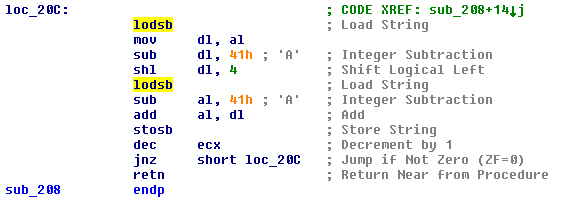
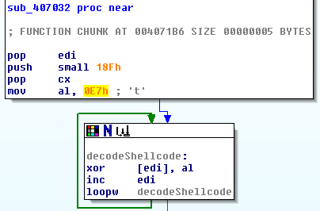
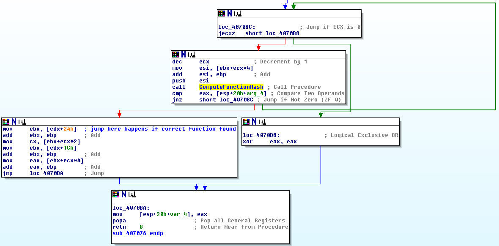
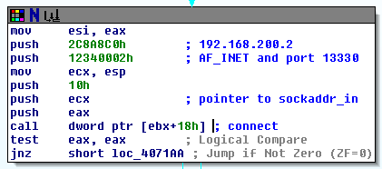

Lab 19-1
========

1. The shellcode is stored in the lower 4 bits of a pair of encoded bytes. The decoder function, shown below, removes the letter "A" from a byte (the shellcode is presumably added to this at encode time), then shifts the bits left, then does the same subtraction from the second byte, without a shift, before adding the two encoded bytes, turning them into one decoded byte of shellcode.



2. The shellcode manually imports the following:

```
WinExec
GetCurrentProcess
URLDownloadToFileA
TerminateProcess
GetSystemDirectoryA
LoadLibraryA
```

3. `http://www.practicalmalwareanalysis.com/shellcode/annoy_user.exe`

4. The shellcode creates a file at `%SystemRoot%\System32\1.exe`.

5. The shellcode downloads a file from the URL above, writes it to the path above, then executes it.


Lab 19-2
========

1. The sample injects its shellcode into the default browser, as found by the registry query shown below.


2. The shellcode is at `0x00407030`.

3. The snippet of code shown below at `0x40703B` runs in a loop to decode the rest of the shellcode by XORing it with `0xE7`:



4. The malware's manual importing routines are shown below.




All told, this sample imports:

```
TerminateProcess
GetCurrentProcess
WSAStartup
WSASOcketA
connect
LoadLibraryA
CreateProcessA
```

5. The shellcode connects to `192.168.200.2` on port 13330.



6. This shellcode runs `cmd.exe` and allows remote access to it.


Lab 19-3
========

This shellcode is cunningly hidden in a PDF.


1. This sample exploits CVE-2008-2992.

2. The shellcode is encoded using standard URL encoding (percent-encoding).

3. The shellcode imports:

```
CloseHandle
TerminateProcess
GetCurrentProcess
GetTempPathA
WriteFile
ShellExecuteA
LoadLibraryA
SetCurrentDirectoryA
ReadFile
SetFilePointer
GetFileSize
CreateFileA
CreateProcessA
GlobalFree
GlobalAlloc
```

4. The sample creates `foo.exe` and `bar.pdf`, both in the temp directory.

5. The shellcode extracts data stored in the PDF it is packaged in, and writes them (see above). It then executes `foo.exe` and opens `bar.pdf`.
